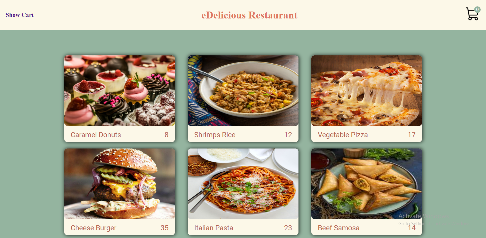

# Restaurant App

A simple restaurant menu ordering app built using JavaScript, HTML, and CSS. This app allows customers to view the menu, and add new meal to their cart.

## Features
- View menu items 


- Add new Item to the cart


- View the bill and total salary


## Technologies used
JavaScript
HTML
CSS

Getting Started
1. Clone the repository:
```git clone https://github.com/YOUR_GITHUB_USERNAME/simple-restaurant-app-js.git```

2. Open the menue.html file in your browser to view the app.

